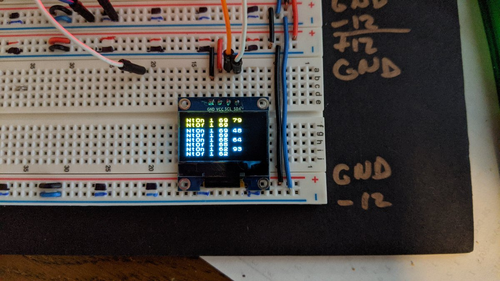
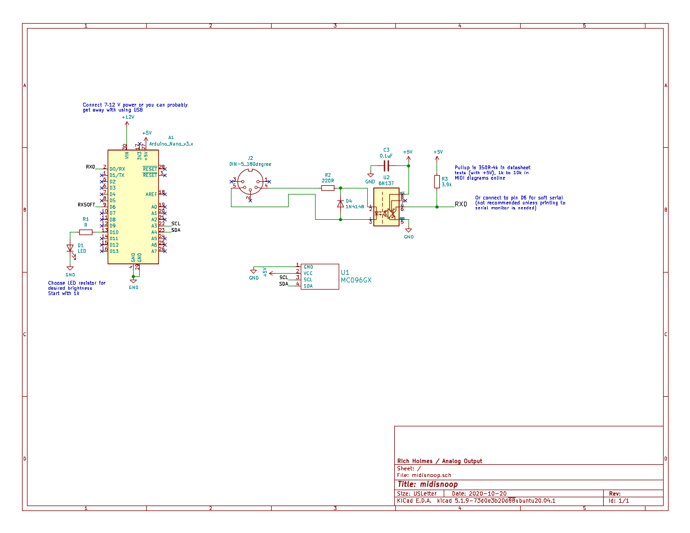

# midisnoop

A little circuit and script for looking at incoming MIDI messages. Simple enough to build on a stripboard but perhaps even simpler to just make on a solderless breadboard as needed.

## Parts
* Arduino Nano
* MIDI In:
    * Optocoupler (6N137, or use other choices with suitable change to pullup resistor)
    * 220Ω and 3.9k resistors
    * 100 nF capacitor
    * 1N4148 diode
    * DIN-5 180° jack
* Display:
    * SSD1306 128x64 I2C OLED module

Input power (VIN) is 9-12V, or you can probably get away with using USB power. +5 V for the optoisolator and display is taken from the Arduino +5V pin.

## Script
The Arduino code uses the standard MIDI, U8G2, and SoftwareSerial libraries, which can be found in the Arduino Library Manager. 

Change symbol definitions as needed:

* DO_PRINT:  0 or 1 to turn off or on diagnostic prints to serial monitor. If used, requires HSERIAL = 0.
* HSERIAL:  0 or 1 for software or hardware serial. Software serial is too slow to keep up with most MIDI and is not recommended unless serial monitor diagnostics are needed. Connect optoisolator to pin D2 for hardware serial, D6 for software serial. When using HSERIAL = 1 you MUST disconnect MIDI from pin D2 before uploading sketch and reconnect when upload is done.
* OLED: 0 or 1 to disable or enable OLED display. Can be used with HSERIAL = 1, so recommended.
* TELL\_xxx: 0 or nonzero to disable or enable diagnostics for MIDI message type xxx (where xxx = NOTEON, NOTEOFF, PITCHBEND, CC, CLOCK, ACTIVE, OTHER). For CLOCK and ACTIVE, use a nonzero number to control how often to display diagnostics. E.g. TELL\_CLOCK=24 means to display a diagnostic every 24 CLOCK messages.

[Hi res schematic (PDF)](./Docs/midisnoop.pdf) 

[Arduino sketch](./Software/midisnoop/midisnoop.ino) 

